

Ain Shams University

Faculty of Computer & Information Sciences 

Computer Science Department 

3D Human Body Reconstruction 

By 

Omar Salah Lofty 

Amir Hosny Mohamed      Mohamed Abdullah El-Saead Magdy Adel Shehata 

Mahmoud Khaled Sayed        Mohamed Adel Abd El-Rahman 

Supervised By 

Dr. Maryam Nabil

Professor in Scientific Computing Department, Faculty of Computer and Information Sciences, 

Ain Shams University 

TA. Ghada El-Shamy 

Assistant Lecturer in Computer Science Department Faculty of Computer and Information Sciences, 

Ain Shams University 

Academic Year 

2022 

Acknowledgment 

`          `A dream does not become reality through magic. It takes sweat, determination and hard work. Let us extend our thanks to all the teaching, technical  and  administrative  staff,  who  had  worked  tirelessly  to accomplish this goal. 

`          `we would like to express our deep and sincere gratitude to our research supervisor, Dr. Maryam Nabil, Lecturer in Faculty of Computer and  Information  Science,  Ain  Shams  University.  for  giving  us  the opportunity to do research and providing invaluable guidance throughout this research. Her dynamism, vision, sincerity and motivation have deeply inspired us. She has taught us the methodology to carry out the research and to present the research works as clearly as possible. It was a great privilege  and  honor  to  work  and  study  under  her  guidance.  We  are extremely grateful for what she has offered us. we would also like to thank her for her friendship, empathy, and great sense of humor. We would also like  to  thank  TA.  Ghada  El-Shamy,  for  her  guidance,  continuous encouragement, and support. She played important role in finalizing this project  

`          `Finally, we sincerely thank all the people who helped, supported, and encouraged us to successfully finish the graduation project. 

Abstract 

3D objects have become a field of scientific research in our time, and this matter creates aspirations, not only for making 3D virtual models, But for creating 3D virtual world. To achieve this goal we must start with creating virtual humans in this virtual world. In addition, this should be achieved in simple way. This project introduces simple way to estimate the volumetric shape(3D) of human body from 2D image of that body captured by simple camera. This is done by train neural network to estimate 3D needed information that 3D engines need to understand the volumetric shapes, this neural network’s parameters are trained on Human 3.6m dataset this data provide the model with 3.6 million human body shapes with reconstruction information for each one. 

The output of this neural network is passed through fitting model (SMPL) to get more realistic shape of the estimated reconstruction information.  

The final output provides us with ready-to-use 3D model, and we can look to the scene from another perspective. 

In addition, we make API to simply feed the trained model with input and it returns 3D reconstructed object that you can displaying it with any 3D engine or 3D viewer (e.g., Blender, Unity, Unreal ...). 

Contents 

Acknowledgment……………………………………………………………...  3 Abstract………………………………………………………………………..  4 List of Figures………………………………………………………………….  7 List of Abbreviations………………………………………………………......  8 ……………………………………………………………………………………... Chapter 1 :  Introduction  9 

1. Motivation…………………………………………….  10 
1. Problem Definition……………………………………  11 
1. Objective……………………………………………...  12 
1. Document Organization………………………………  14 

……………………………………………………………………………………... Chapter 2:  Background  15 

1. Deep Learning …………………………………………  16 
1. related scientific background …………………………..  17 
1. 3D Reconstruction survey ……………………………..  21 
1. Similar systems ………………………………………...  24 

……………………………………………………………………………………... Chapter 3:  Analysis and design     28 

3\.1  System Overview ………………………………………  29 

3\.4  System Analysis ……………………………………….  32 

……………………………………………………………………………………... Chapter 4:  Implementation  33 

1. CNN and how it works …………………………………  34 
1. Datasets ………………………………………………..  35 
1. Segmentation …………………………………………..  38 
1. Feature extraction ……………………………………...  44 
1. 3D pose regression …………………………………….  47 
1. SMPL ………………………………………………….  48 
1. Final architecture ………………………………………  49 
1. Backend.……………………………………………….  50 
1. Frontend ……………………………………………….  51 

Chapter 5:  User Manual …………………………………………………..  53 

……………………………………………………………………………………... Chapter 6:  Conclusions and Future Work  55 

1. Conclusions ……………………………………………  56 
1. Future Work ……………………………………………  58 

……………………………………………………………………………………... References  60 

Figures

Figure 1: illustrative image for CNN.………………………………………….  18 Figure 2: Blender Logo………………………………………………………...  19 Figure 3: SMPL shapes ……………………………………………………….  20 Figure 4: PyMAF architecture ………………………………………………..   24 Figure 5: DeepHuman architecture ……………………………………………  25 Figure 6: DIMNet architecture ………………………………………………..  26 Figure 7: Humans in the mirror architecture ………………………………….  27 Figure 8: System architecture …………………………………………………  29 Figure 9: Use Case diagram …………………………………………………..  32 Figure 10: CNN architecture example ………………………………………..  34 Figure 11: H 3.6m dataset composition ……………………………………….  36 Figure 12: sample from h 3.6m dataset ……………………………………….  37 Figure 13: 3D pose visualization ……………………………………………..  37 Figure 14: segmentation example …………………………………………….  38 Figure 15: segmentation basic architecture …………………………………..   39 Figure 16: U-net architecture …………………………………………………  40 Figure 17: DeepLabv3 architecture components ……………………………..  41 Figure 18: atrous convolution explanation ……………………………………  43 Figure 19: DeepLapv3 architecture ……………………………………………  43 Figure 20: feature extraction explanation ……………………………………..   44 Figure 21: ResNet50 architecture ……………………………………………..  45 Figure 22: ResNet50 architecture hyperparameters …………………………..  46 Figure 23: 3D pose regressor ………………………………………………….  47 

Figure 24: some SMPL shapes ………………………………………………..   48 Figure 25: Overall architecture ……………………………………………….   49 

Abbreviations 

CAGD à Computer Aided Geometric Design CNN à Convolution Neural Network 

SMPL à Skinned Multi Person Linear model FC à Fully Connected 

APIà Application Programming Interface Obj à Object 

Conv à Convolution layer 

RGB à Red, Green, and Blue 

H 3.6M à Human 3.6 Million 

BN à Batch Normalization 

RelU à Rectified Linear Unit 

Res à Residual  

ASPP à Atrous Spatial Pyramid Pooling FPN à Feature Pyramid Network 

DSSD à Deep Single Shot Detector 

DCNN à Deep Convolution Neural Network ML à Machine Learning 

MLP à Multi-Layer Perceptron  

AC à Activation Function 

Val Loss à Validation Loss 

Introduction 

1. Motivation 

Nowadays Artificial Intelligence and computer vision has many applications like (e.g. metaverse) this development will open wide 3D world, The research of 3D reconstructions has always been a difficult goal. Using 3D reconstruction one can determine any object’s 3D profile, as well as knowing the 3D coordinates of the object’s points on the profile. The 3D reconstruction of objects is a generally scientific problem and core technology of a wide variety of fields, such as Computer Aided Geometric Design (CAGD), computer graphics, computer animation, computer vision, computational science, virtual reality, digital media, etc. 

There are many attempts to reconstruct objects with 3D information, but all of these attempts depend on special equipment (such as stereo camera or taking many picture for more perspective under special prepared conditions). 

So, it is very helpful to use artificial intelligence to avoid the cost that results from the extra needed setups to make 3D reconstruction task .in addition, that make the 3D reconstruction simply used by anyone and anywhere. 

The biggest challenge lies in how accurate artificial intelligence is so that we can rely on it completely.

2. Problem Definition  

The costly way that depends on setups and special equipment, it creates accurate shapes. 

To rely on artificial intelligence in this task, it must be as accurate as possible, so we can replace the costly setups that create accurate  

So, we must train artificial intelligence model to learn how to reconstruct the 3D human body from 2D images. or in other words we want from the AI model to predict about the human body that in the image how it’s going to be in 3D space. 

In addition, this technology must be simply to use from any user that has no scientific background about how it works. 

3. Objectives  
- Aiming to massively reduce the cost of 3D Characters design. 

The cost of hiring professionals for graphic and motion design is increasing day by day, with the use of 3D Reconstruction, Designing any character will be done in seconds. Thanks to CNNs. 

- 3D Animating has never been easier with just a sequence of frames. 

We can extract a frame? that means we can also extract a video, instead of animating each frame by frame, imagine the process! you can just let the model extract every frame of a video with no need of the time-consuming effort of an animator. 

- Free viewpoint and 360-degree reconstruction. 

An obj file can be used as a 360-degree viewport. giving the full view and power to control the perspective of the human shape that was just a 2D plane. 

- Faster GPU process. 

Rendering animation created by hand will take much time. instead, the GPU will use much less time to extract a sequence of 2D frames to 3D. 

- With more model accuracy in the future, 3D human reconstruction aims to recover the 3D geometry and appearance of humans from images, videos, or depth data. 

In the future, With more data and more challenging parts to be solved, we can reimagine any statue, historical place and even the faces of such historical personas. 

4. Document Organization 

The rest of this document is organized as follows:  Chapter 2: Background 

This chapter gives an overview of the scientific background of deep learning, CNN and why it was selected specifically for this study, it also provides a brief overview of 3D modeling and its applications. 

Chapter 3: Analysis and Design 

This chapter dives into the process of reconstructing system components and analyzing them to identify the system architecture and requirements and what type of users that are going to be interacting with the system. 

Chapter 4: Implementation  

This chapter is dedicated to explaining how the system is built, how all its modules are structured and how it is operated and used to achieve the intended goal. 

Chapter 5: User Manual  

This chapter is intended to provide important information on how a user can use the system step by step complete the desired task(s). 

Chapter 6: Conclusion and Future Work 

This Chapter highlights the entire key point and final outcomes based on work done in this study. It also presents future work that should be done further. 

![ref1] 

Background 

1. Deep Learning

Deep learning is a subset of machine learning, which is essentially a neural network with three or more layers. These neural networks attempt to simulate the behavior of the human brain—albeit far from matching its ability—allowing it to “learn” from large amounts of data. While a neural network with a single layer can still make approximate predictions, additional hidden layers can help to optimize and refine for accuracy. 

Deep learning drives many artificial intelligence (AI) applications and services that improve automation, performing analytical and physical tasks without human intervention. Deep learning technology lies behind everyday products and services (such as digital assistants, voice- enabled TV remotes, and credit card fraud detection) as well as emerging technologies (such as self-driving cars and 3D Reconstruction). 

How deep learning works 

Deep learning neural networks, or artificial neural networks, attempts to mimic the human brain through a combination of data inputs, weights, and bias. These elements work together to accurately recognize, classify, and describe objects within the data. 

Deep neural networks consist of multiple layers of interconnected nodes, each building upon the previous layer to refine and optimize the prediction or categorization. This progression of computations through the network is called forward propagation. The input and output layers of a deep neural network are called  visible layers. The input layer is where the deep learning model ingests the data for processing, and the output layer is where the final prediction or classification is made. 

2. related scientific background

Convolutional neural networks (CNNs), used primarily in computer vision and image classification applications, can detect features and patterns within an image, enabling tasks, like object detection or recognition. In 2015, a CNN bested a human in an object recognition challenge for the first time. 

A CNN is a Deep Learning algorithm which can take in an input image, assign importance (learnable weights and biases) to various aspects/objects in the image and be able to differentiate one from the other. The pre-processing required in a ConvNet is much lower as compared to other classification algorithms. While in primitive methods filters are hand-engineered, with enough training, ConvNets can learn these filters/characteristics. 

The agenda for this field is to enable machines to view the world as humans do, perceive it in a similar manner and even use the knowledge for a multitude of tasks such as Image & Video recognition, Image Analysis & Classification, Media Recreation, Recommendation Systems, Natural Language Processing, etc. 

` `The advancements in Computer Vision with Deep Learning has been constructed and perfected with time 

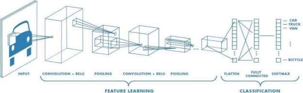

Figure 1

3D Modeling 

3D modeling is the process of creating a 3D representation of any surface or object by manipulating polygons, edges, and vertices in simulated 3D space. You can see the results of 3D modeling in movies, animations, and video games filled with fantastical and imaginative creatures and structures. 

3D modeling is used in a wide range of fields, including engineering, architecture, entertainment, film, special effects, game development, and commercial advertising. 

A popular example of 3D technology is its use in major motion pictures. Just think of the scenery in James Cameron's 2009 

movie Avatar. The film helped transform the 3D industry when it used many of the concepts of 3D modeling to create the movie's planet, Pandora. 

Blender

Blender is a free and open-source 3D computer graphics software toolset used for creating animated films, visual effects, art, 3D- printed models, motion graphics, interactive 3D applications, virtual reality, and, formerly, video games.      Blender's features include 3D modelling, UV mapping, texturing, digital drawing, raster graphics editing, rigging and skinning, soft body simulation 

, sculpting, animation, match moving, rendering, motion graphics, and compositing. 

In our case, blender used in controlling and visualize the 3D reconstructed model 

Figure 2 

Skinning model (SMPL) 

SMPL is a realistic 3D model of the human body that is based on skinning and blend shapes and is learned from thousands of 3D body scans. This site provides resources to learn about SMPL, including example FBX files with animated SMPL models, and code for using SMPL in Python. 

In our case, SMPL is used in fit the output to more realistic shape of human body 

Figure 3 

Data Analysis and Engineering 

Mining and extracting meaningful patterns from massive input data for decision-making, prediction, and other inferencing is at the core of Big Data Analytics. In addition to analyzing massive volumes of data, Big Data Analytics poses other unique challenges for machine learning and data analysis, including format variation of the raw data, fast-moving streaming data, trustworthiness of the data analysis, highly distributed input sources, noisy and poor quality data, high dimensionality, scalability of algorithms, imbalanced input data, unsupervised and un- categorized data, limited supervised/labeled data, etc. Adequate data 

storage, data indexing/tagging, and fast information retrieval are other key problems in Big Data Analytics. Consequently, innovative data analysis and data management solutions are warranted when working with Big Data. For example, in a recent work we examined the high- dimensionality of bioinformatics domain data and investigated feature selection techniques to address the problem. 

3. 3D Reconstruction survey 

Traditional reconstruction pipeline relies heavily on hardware to capture the full structure and appearance of a target scene and provide enough evidence for the algorithm to draw inferences. So far, researchers have built up various capture systems, which usually consist of a large group of cameras carefully arranged in fixed positions relative to each other to capture the color and depth 

information. The pictures collected by these systems are taken from dense viewpoints and often contain much redundancy, they are fed 

into the reconstruction pipeline as input. By utilizing the redundancy within the input and integrating the densely sampled images, this pipeline can produce satisfactory reconstruction results. 

Offline reconstruction 

Multi-View Stereo (MVS) is a widely known 3D reconstruction technique that uses feature correspondence across a set of images, which are projections of the same 3D object in multiple views, as the main cue to estimate 3D structures. Schönberger et al. (2016) achieve dense reconstruction with a robust and efficient performance by augmenting the framework proposed by Zheng et al. (2014) in multiple 

aspects. For unstructured image collections, Structure from Motion (SfM) is one of the most widely used techniques to recover camera parameters like position and orientation for each image. The main challenges of building a 

successful SfM system are robustness, accuracy, completeness, and scalability. To enhance the ability of SfM systems in the above aspects, Schonberger and Frahm (2016) present a novel incremental SfM algorithm that introduces a series of strategies for geometric verification, next best view selection, triangulation, 

bundle adjustment, and drift effect mitigation. 

Real-time reconstruction 

Despite the continuing progress on offline reconstruction, the long processing time of dense camera views makes such methods unacceptable for applications that require immediate feedback. Therefore, a large volume of research has been done to gradually simplify the input image set and lower the computational cost to achieve real-time reconstruction. Using only a single commodity 

depth sensor, Newcombe et al. (2015) succeed in progressively completing the surface model by establishing dense correspondences from depth maps to a canonical human model and fusing the streaming input measurements over time. However, robustness appears to be a major concern, since reconstruction may fail 

when dealing with rapid human motions. To overcome this problem, Yu et al. (2018) introduce SMPL models to regularize the optimization process on dense correspondences, which significantly prevents the optimization from falling into local minima. 

SMPL 

Generally speaking, SMPL (Loper et al., 2015) is a function determined by a set of shape, pose, and translation parameters, which outputs a mesh with 6890 vertices. To model human shapes, SMPL learns a low- dimensional shape space from a large number of scans and represents 

a specific shape with a set of coefficients. The pose parameters are defined by a template human skeleton with 23 joints, which include a set of relative rotations between parts in terms of the axis–angle representation and a global rotation relative to the root joint. The translation parameters are measurements of the relative position between the SMPL mesh and the camera. 

4. Similar Systems  

PyMAF: 3D Human Pose and Shape Regression with Pyramidal Mesh Alignment Feedback Loop

By: Institute of Automation, Chinese Academy of SciencesNanjing University The University of Sydney Tsinghua University

Its based on regression-based methods which have recently shown promising results in reconstructing human meshes from monocular images. By directly mapping from raw pixels to model parameters, these methods can produce parametric models in a feed-forward manner via neural networks. However, 

minor deviation in parameters may lead to noticeable misalignment between the estimated meshes and image evidences. To address this issue, we propose a Pyramidal Mesh Alignment Feedback (PyMAF) loop to leverage a feature pyramid and rectify the predicted parameters explicitly based on the mesh-image 

alignment status in a deep regressor. 

They made use of different segmentation techniques and two different datasets, with more than a SMPL approach.  

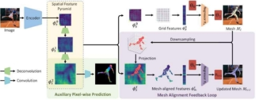

Figure 4                                                                                                      Results of PyMAF 

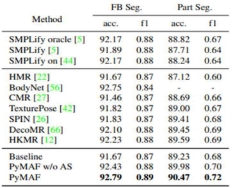

DeepHuman: 3D Human Reconstruction From a Single Image 

By: Tsinghua University, Beihang University and Orbbec Company 

In order to recreate a 3D human from a single RGB image, They suggested DeepHuman, an image-guided volume-to-volume translation CNN. They made use of a dense semantic representation produced from SMPL model as an additional input to lessen the ambiguities connected with the surface geometry reconstruction, even for the reconstruction of invisible areas. their network's ability to combine diverse scales of image data into 3D space through volumetric feature transformation, which aids in the recovery of precise surface geometry, is one of its important strengths. A normal refinement network that can be used 

with the volume generation network utilizing our suggested volumetric normal projection layer further improves the visible surface features. Additionally, we provide THuman, a 3D real-world 7000 or more models make up the dataset of human models. 

The network is trained using training data generated from the dataset. Overall, due to the specific design of the network approaches. 

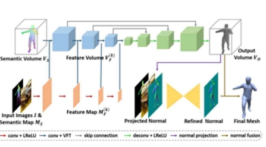

Figure 5 

Results:

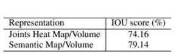

DIMNet: Dense implicit function network for 3D human body reconstruction 

By: School of Electrical and Information Engineering, Tianjin University, Tianjin, 300072, China Department of Computer Science and Engineering, Santa Clara University, Santa Clara, CA 95053, USA 

This paper applies deep learning models on reconstructing 3D human body based on monocular images. First of all, this paper uses Stacked Hourglass network to perform convolution operations on monocular images collected from different views. Then Multi-Layer Perceptron’s (MLPs) are used to decode the encoded high-level images. The feature codes in the two views(main and side) are fused, and the interior and exterior points are classified by the fusion features, so as to obtain the corresponding 3D occupancy field. At last, the Marching Cube algorithm is used for 3D reconstruction with a specific threshold and then we use Laplace smoothing algorithm to remove artifacts. This paper proposes a dense sampling strategy based on the important joint points of the human body, which has a certain optimization effect on the realization of high-precision 3D reconstruction. The performance of the proposed scheme has been validated on the open source datasets, MGN dataset and the THuman dataset, provided by Tsinghua University. The proposed scheme can reconstruct features such as clothing folds, color textures, and facial details, and has great potential to be applied in different applications. 

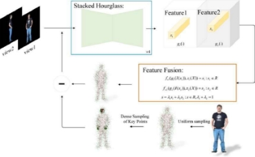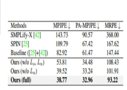

Figure 6 

Reconstructing 3D Human Pose by Watching Humans in the Mirror 

By: Qi Fang\* Qing Shuai∗ Junting Dong Hujun Bao Xiaowei Zhou†State Key Lab of CAD&CG, Zhejiang University 

They introduced the new task of reconstructing 3D human pose from a single image in which they can see the person and the person’s image through a mirror. Compared to general scenarios of 3D pose estimation from a single view, the mirror reflection provides an additional view for resolving the depth ambiguity. We develop an optimization-based approach that exploits mirror symmetry constraints for accurate 3D pose reconstruction. We also provide a method to estimate the surface normal of the mirror from vanishing points in the single image. To validate the proposed approach, we collect a large-scale dataset named Mirrored-Human, which covers a large variety of human subjects, poses and backgrounds. The experiments demonstrate that, when trained on Mirrored- Human with our reconstructed 3D poses as pseudo ground-truth, the accuracy and generalizability of existing single-view 3D pose estimators can be largely improved. 

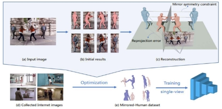

Figure 7

Results: 

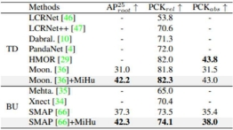

![ref1] 

Analysis & Design 

1. System Overview 
1. System Architecture 

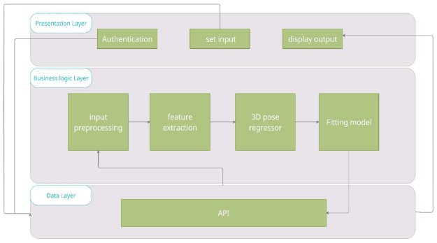

Figure 8

Presentation layer: 

- Authentication: collecting information about user. 
- Set input:  get the input from user to start the 3D reconstruction process. 
- Display output:  after the process finishes the system return the results to be displayed in user interface

Business layer: 

- Input preprocessing:  apply some preprocessing techniques to get more accurate predictions
- Feature  extraction: this  module  contains  some  deep  learning algorithms to get features from 2d images that helps model to 

understand more about the components of the scene.

- 3D pose regressor: trying to estimate the 3D pose of human body in the input image.
- Fitting model: by the predicted 3D information’s this module try to fit them into 3D body.  

Data Layer: 

This layer contains the API that controls the communications between the system and the user interface.  

2. Functional Requirements: 
- A user shall be able to input image by browser.
- The system shall reconstruct the 3D object of the human body in the input image.
- User can register and login.
- User can view the 3D object in the browser.
3. Nonfunctional Requirements: 
- Performance:  The  system  respond  time  doesn’t  exceed  1  or  2 seconds. 
- Security: The system handles safe login and logout through session. 
- Reliability: The website is splits into more than one page and each one of them has its specific function and avoids system crashing and checks data validation. 
- Usability: The system has user friendly interface. 
- Availability: The Web page is available and avoids being crashed. 
- Portability: The website can be used at any browser. 
4. System Users 
1. Intended Users: Any user can create 3D reconstructed objects for any image contains human body.  
1. User Characteristics: No technical experience or skills needed 

for the user to benefit from the system. 

2. System Analysis & Design 

3\.2.1 Use Case Diagram 

Figure 9

![ref1] 

Implementation 

1. CNN and how it works. 

The convolutional Neural Network CNN works by getting an image, designating it some weightage based on the different objects of the image, and then distinguishing them from each other. CNN requires very little pre-process data as compared to other deep learning algorithms. One of the main capabilities of CNN is that it applies primitive methods for training its classifiers, which makes it good enough to learn the characteristics of the target object. 

CNN is based on analogous architecture, as found in the neurons of the human brain, specifically the Visual Cortex. Each of the neurons gives a response to a certain stimulus in a specific region of the visual area identified as the Receptive field. These collections overlap in order to contain the whole visual area. 

CNN algorithm is based on various modules that are structured in a specific workflow that are listed as follows: 

- Input Image 
- Convolution Layer (Kernel) 
- Pooling Layer 
- Classification — Fully Connected Layer 

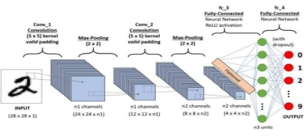

Figure 10

2. DataSets 

Seg DataSet

General Public License Dataset from Kaggle, Initially consisted of ~5000 samples. 

This dataset contains 5000 image of human bodies and binary segmentation mask as a ground truth. 

To improve learning algorithm outcomes, we apply some augmentation techniques. 

Data Augmentation

in data analysis are techniques used to increase the amount of data by adding slightly modified copies of already existing data or newly created synthetic data from existing data. It acts as a regularizer and helps reduce overfitting when training a machine learning model. It is closely related to oversampling in data analysis. 

Applied augmentation techniques: 

- Horizontal Flip by a pixel 
- RGB to gray 
- Drop some pixels randomly. 
- Rotating 

Seg Dataset after augmentation: 

The result data size is grows to be ~ 20,000 samples. 

\- 35 - 

Human 3.6M dataset 

The Human3.6M dataset is one of the largest motion capture datasets, which consists of 3.6 million human poses and corresponding images captured by a high-speed motion capture system. There are 4 high- resolution progressive scan cameras to acquire video data at 50 Hz. The dataset contains activities by 11 professional actors in 17 scenarios: discussion, smoking, taking photo, talking on the phone, etc., as well as provides accurate 3D joint positions and high-resolution videos.

We could obtain exactly a portion of 312188 samples. 

the figure below shows some images from human 3.6m data set, showing different subjects, poses, viewing angels and variate scenarios.  

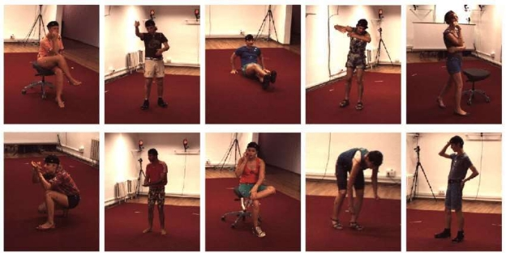

Figure 11

Figure 12

The above figure shows An example of data in Human 3.6m dataset from left to right: 

1) RGB image, 
1) person silhouette, 
1) time-of-flight (depth) data, 
1) 3D pose data (shown using a synthetic graphics model), 
1) body surface scan. 

The figure below shows example of 3D pose estimation results 

Figure 13

3. Segmentation 

In digital image processing and computer vision, image segmentation is the process of partitioning a digital image into multiple image segments, also known as image regions or image objects (sets of pixels). The goal of segmentation is to simplify and/or change the representation of an image into something that is more meaningful and easier to analyze. Image segmentation is typically used to locate objects and boundaries (lines, curves, etc.) in images. More precisely, image segmentation is the process of assigning a label to every pixel in an image such that pixels with the same label share certain characteristics. 

The result of image segmentation is a set of segments that collectively cover the entire image, or a set of contours extracted from the image (see edge detection). Each of the pixels in a region are similar with respect to some characteristic or computed property , such as color, intensity, or texture. Adjacent regions are significantly different color respect to the same characteristic(s). When applied to a stack of images, typical in medical imaging, the resulting contours after image segmentation can be used to create 3D reconstructions with the help of deep learning algorithms. 

Specifically, this system uses Semantic segmentation, it is an approach detecting, for every pixel, belonging class of the object. For example, when all people in a figure are segmented as one object and background as one object. 

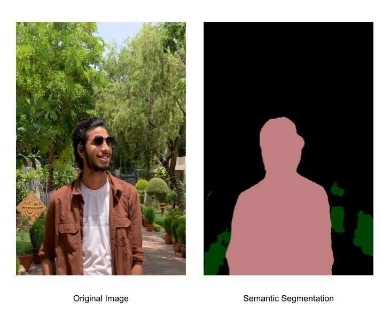

Figure 14 

Image Segmentation deep learning architectures 

The basic architecture in image segmentation consists of an encoder and a decoder.  

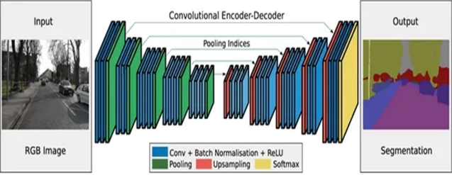

Figure 15

The encoder extracts features from the image through filters. The decoder is responsible for generating the final output which is usually a segmentation mask containing the outline of the object. Most of the architectures have this architecture or a variant of it. 

Image segmentation process run into the preprocessing module  

Segment the human body from the image increasing the performance of the model during predicting or estimating 3D information’s.   

we try to use more than one architecture for segmentation, let’s look at a couple of them. 

UNET — Network Architecture 

UNET is a U-shaped encoder-decoder network architecture, which consists of four encoder blocks and four decoder blocks that are connected via a bridge. The encoder network (contracting path) half the spatial dimensions and double the number of filters (feature channels) at each encoder block. Likewise, the decoder network doubles the spatial dimensions and half the number of feature channels. 

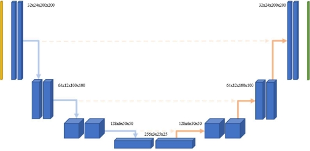

Figure 16

The contracting path is made up of: Encoder Network 

The encoder network acts as the feature extractor and learns an abstract representation of the input image through a sequence of the encoder blocks. Each encoder block consists of two 3x3 convolutions, where each convolution is 

followed by a ReLU (Rectified Linear Unit) activation function. The ReLU activation function introduces non-linearity into the network, which helps in the better generalization of the training data. The output of the ReLU acts as a skip 

connection for the corresponding decoder block. 

Next, follows a 2x2 max-pooling, where the spatial dimensions (height and width) 

of the feature maps are reduced by half. This reduces the computational cost by decreasing the number of trainable parameters. 

Skip Connections 

These skip connections provide additional information that helps the decoder to generate better semantic features. They also act as a shortcut connection that helps the indirect flow of gradients to the earlier layers without any degradation. In simple terms, we can say that skip connection helps in better flow of gradient while backpropagation, which in turn helps the network to learn better representation 

.

Bridge 

The bridge connects the encoder and the decoder network and completes the flow of information. It consists of two 3x3 convolutions, where each convolution is followed by a ReLU activation function. 

Decoder Network 

The decoder network is used to take the abstract representation and generate a semantic segmentation mask. The decoder block starts with a 2x2 transpose convolution. Next, it is concatenated with the corresponding skip connection feature map from the encoder block. These skip connections provide features 

from earlier layers that are sometimes lost due to the depth of the network. After that, two 3x3 convolutions are used, where each convolution is followed by a ReLU activation function. 

The output of the last decoder passes through a 1x1 convolution with sigmoid activation. The sigmoid activation function gives the segmentation mask representing the pixel-wise classification. 

The prediction Accuracy of this model: 0.95404 

DeepLabv3 architecture 

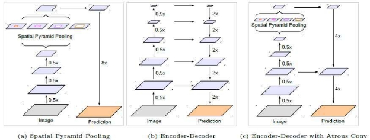

Figure 17

- (a): With Atrous Spatial Pyramid Pooling (ASPP), able to encode multi- scale contextual information. 
- (b): With Encoder-Decoder Architecture, the location/spatial information is recovered. Encoder-Decoder Architecture has been proved to be useful in literature such as FPN, DSSD, SegNet and U-Net for different kinds of purposes. 
- (C): DeepLabv3+ makes use of (a) and (b). 

Atrous Separable Convolution 

For each location i on the output y and a filter w, atrous convolution is applied over the input feature map x where the atrous rate r corresponds to the stride with which we sample the input signal. 

The figure below shows how atrous convolution works

Figure 18 

Overview for the architecture 

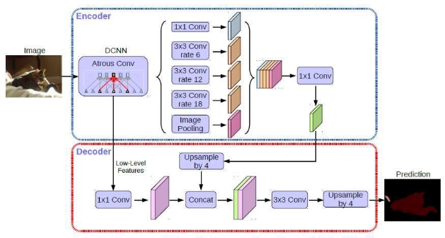

Figure 19

The prediction Accuracy of this model: 0.9335 

4. Feature Extraction 

Feature extraction is a core component of the computer vision pipeline. In fact, the entire deep learning model works around the idea of 

extracting useful features which clearly define the objects in the image. We’re going to spend a little more time here because it’s important that you understand what a feature is, what a vector of features is, and why we extract features. 

In deep learning, we don’t need to manually extract features from the image. The network automatically extracts features and learns their importance on the output by applying weights to its connections. You feed the raw image to the network and, as it passes through the network layers, it identifies patterns within the image to create features. Neural networks can be thought of as feature extractors + classifiers which are end-to-end trainable as opposed to traditional ML models that use hand-crafted features. 

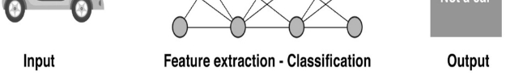

Figure 20

ResNet50 

We use ResNet50 as a feature extractor. 

Extracting 2048 features from image through ResNet50 as a Model backbone. 

Let’s look at how it works. 

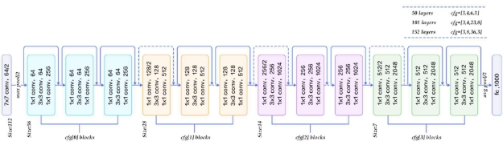

Figure 21

- A convolution with a kernel size of 7 \* 7 and 64 different kernels all with a stride of size 2 giving us 1 layer. 
- Next we see max pooling with also a stride size of 2. 
- In the next convolution there is a 1 \* 1,64 kernel following this a 3 \* 3,64 kernel and at last a 1 \* 1,256 kernel, These three layers are repeated in total 3 time so giving us 9 layers in this step. 
- Next we see kernel of 1 \* 1,128 after that a kernel of 3 \* 3,128 and at last a kernel of 1 \* 1,512 this step was repeated 4 time so giving us 12 layers in this step. 
- After that there is a kernal of 1 \* 1,256 and two more kernels with 3 \* 3,256 and 1 \* 1,1024 and this is repeated 6 time giving us a total of 18 layers. 
- And then again a 1 \* 1,512 kernel with two more of 3 \* 3,512 and 1 \* 1,2048 and this was repeated 3 times giving us a total of 9 layers. 
- After that we do a average pool and end it with a fully connected layer containing 1000 nodes and at the end a softmax function so this gives us 1 layer. 

The figure below shows the specifications of the architecture 

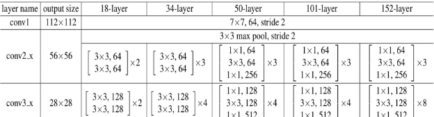

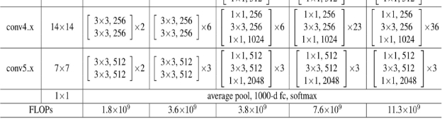

Figure 22

This architecture can be used on computer vision tasks such as image classification, object localization, object detection. 

and this framework can also be applied to non-computer vision tasks to give them the benefit of depth and to reduce the computational expense also. 

5. 3D pose Regressor 

The 3D pose Regressor in this model is simply the last fully connected neural network that takes the extracted features from the previous phase as input. 

Fully Connected Layer is simply, feed forward neural networks.  Fully Connected Layers form the last few layers in the network. 

The input to the fully connected layer is the output from the final Pooling or Convolutional Layer, which is flattened and then fed into the fully connected layer. 

The purpose of this network is to build an regression system to predict the 3D poses from the extracted features. 

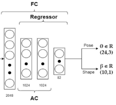

Figure 23

The first layer is the flatten layer to the output of the previous network. 

The second and third layers each contains 1024 neuron represents the FC layer, with drop out = 0.5 to prevent the over fitting   

The last layer is the output layer with identity activation function, it contains 82 neurons to get 82 numbers as output for the skinning model in the next phase. 

6. SMPL 

The 82 constructed numbers from the model in the previous phase, we can split them into two groups, 72 number to represents the 3D pose coordinates, and they are represent (72/3) = 23 key joints and 10 numbers represents some additional information about the 3D human body called shape parameters, it’s needed by the skinning model to reconstruct the human body more efficiently.  

Skinned Multi-Person Linear model (SMPL) model decomposes body shape into identity-dependent shape and non-rigid pose-dependent shape, it takes a vertex- based skinning approach that uses corrective blend shapes. A single blend shape is represented as a vector of concatenated vertex offsets. it begins with an artist created mesh with N = 6890 vertices and K = 23 joints. The mesh has the same topology for men and women, spatially varying resolution, a clean quad structure, a segmentation into parts, initial blend weights, and a skeletal rig. 

The figure below shows some SMPL models with the same key joints but with different shape parameters.   

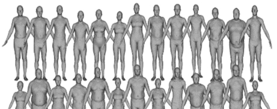

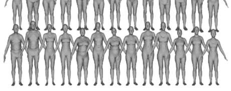

Figure 24 

7. Final Architecture  

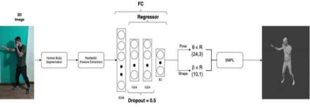

Figure 25

1-  Human body segmentation: 

Deeplabv3+ is the selected architecture to do this task. Trained on the seg dataset from Kaggle. 

25 epochs. 

Input size: 224\*224. 

val loss: 1.04 

accuracy: 93.35% 

2-  3D Reconstruction model: 

Contains ResNet50 as feature extractor and FC as 3D pose regressor. Trained on Human 3.6M dataset. 

20 epochs. 

Input size: 224\*224. 

val loss: 0.06 

Accuracy: 92% 

3-  SMPL: Skinning model

8. 3D Reconstruction Backend 

We use Laravel PHP framework in our project backend development  

Laravel is an open-source PHP framework, which is robust and easy to understand. It follows a model-view-controller design pattern. Laravel reuses the existing components of different frameworks which helps in creating a web application. The web application thus designed is more structured and pragmatic. 

Laravel offers a rich set of functionalities which incorporates the basic features of PHP frameworks like CodeIgniter, Yii and other programming languages like Ruby on Rails. Laravel has a very rich set of features which will boost the speed of web development. 

If you are familiar with Core PHP and Advanced PHP, Laravel will make your task easier. It saves a lot time if you are planning to develop a website from scratch. Moreover, a website built in Laravel is secure and prevents several web attacks. 

We created restful API that contain 1 endpoint

ConvertTo3D(): 

- endpoint route “/Upload” 
- endpoint method POST 
- this endpoint takes request that contains the input image file and save the input image in assets folder then call the python 3D 

reconstruction model which converts the input image to 3D “.obj” file and save the output in our assets library.

- Response is in JSON format and contains the file path to the generated “.obj” file.
9. 3D Reconstruction Frontend 

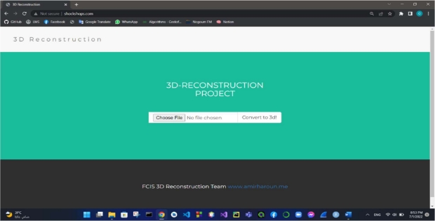

- We made web page as a front end to show the results of the reconstruction system. 
- Web page contains one screen (main screen) to make the process more simple. 
- We create this page using HTML 5, CSS 3, Bootstrap5, Java Script and VUE JavaScript Framework  

Vue is a JavaScript framework for building user interfaces. It builds 

on top of standard HTML, CSS and JavaScript, and provides a declarative and component-based programming model that helps you efficiently develop user interfaces, be it simple or complex.

We used vue componenet “3d viewer” to show our model generated obj file, it gave as complete control on the output obj file ( 360 view, zooming, Translation ) 

 

User Manual 

Ø 3D Reconstruction web application using php running on local host. 

1) Click on “Choose File” button.

2) Then popup window will appear as in next figure to choose existed Picture from PC.

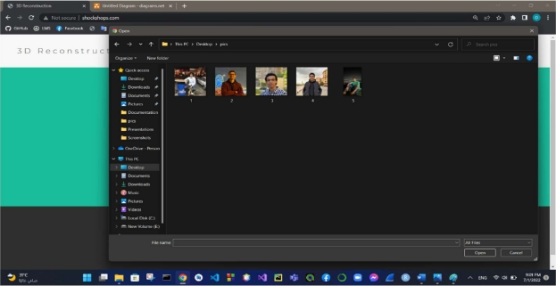

3) Finally, click on “Covert to 3d!” button to get the 3d model as Obj file showed beside real picture.

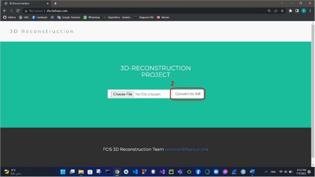

 

Conclusion and future work 

1. Conclusion 

Our project is an entirely automated end-to-end web application architecture that predicts the 3D human body shape from a single photograph. We've demonstrated that combining training with intermediate tasks greatly enhances the  results. We have also shown that the combination of the body parts segmentation and  

Human bodies can be represented well using a multi-view re-projection loss. Additionally, our framework's flexible representation enables us to expand our  method to present striking outcomes on 3D body component segmentation from  a solitary image. Our Graduation Project, in our opinion, can offer a trainable building component.  For upcoming techniques that utilise 3D body data, including virtual clothing alteration. Additionally, we think examining the limitations of utilising merely intermediate For 3D problems, representations is an intriguing study area. Furthermore, for 3D applications where gathering training data is impractical, we think studying the boundaries of using only intermediate representations is a fascinating research path. Studying the 3D body contour while wearing garments is another promising direction. If training data is made available, volumetric representation may be able to capture this additional geometry. With more data in the future, we believe 3D reconstruction will take over since our results with sparse data was relatively impressive. 

Conclusion of experiments with different hyperparameters 

|Batch Size |Epochs |Feature extractor |segmentation |accuracy |
| :-: | - | - | - | - |
|64 |11 |inceptionResNet |without |0\.7134 |
|128 |12 |inceptionResNet |Without |0\.4952 |
|16 |2 |inceptionResNet |DeepLapv3 |0\.4885 |
|128 |20 |ResNet50 |DeepLapv3 |0\.92 |

2. Future work 
- Currently, differentiable rendering-based methods train a network for each human separately, where the training process generally takes hours (Peng et al., 2021,a; Liu et al., 2021), which prevents such methods from reconstructing a large population. In contrast, some other methods (Saito et al., 2019, 2020; Hong et al., 2021) only need to train the network once and are able to generalize across different humans, while the quality of reconstruction results is less satisfactory. This enlightens us to combine differentiable rendering with generalizable methods to achieve both high-quality and efficient reconstruction of new subjects. 
- Real-world scenarios usually contain multiple humans and human–object interactions (Zheng et al., 2021a; Zhang et al., 2021a; Sun et al., 2021). To achieve reconstruction for these scenes, efficient representations and robust reconstruction algorithms for multiple people and human–object interactions need to be developed. 
- Even though detailed 3D human models can be acquired, there is still a long way to generate photorealistic images with these models. Classical graphics pipeline requires expensive capture hardware and a long time to render high-quality images, but the differences between rendered images and real images are still noticeable, particularly for animation. In another line of works, neural rendering (Karras et al., 2020, 2019) has delivered impressive results on image generation. It is an interesting and important direction to study controllable neural rendering with known human and scene geometries. 
- Many applications require scene content editing, such as adding or removing objects (Yu et al., 2021a), changing human clothes (Xiang et al., 2021), and relighting (Boss et al., 2020). This motivates us to find better ways to recover more accurate human geometries and materials and decompose observed humans into bodies and editable clothes.

References 

1. Cui, Y., Chang, W., Nöll, T., Stricker, D.: KinectAvatar: fully automatic body capture using a single kinect. In: Park, J.-I., Kim, J. (eds.) ACCV 2012. LNCS, vol. 7729, pp. 133–147. Springer, Heidelberg (2013). https://doi.org/10.1007/978-3-642-37484-5\_12 
1. Dou, M., et al.: Fusion4D: real-time performance capture of challenging scenes. ACM Trans. Graph. 35(4) (2016). Google Scholar https://doi.org/10.1145/2897824.2925969 
1. Fankhauser, P., Bloesch, M., Rodriguez, D., Kaestner, R., Hutter, M., Siegwart, R.: Kinect v2 for mobile robot navigation: Evaluation and modeling. In: 2015 International Conference on Advanced Robotics (ICAR), pp. 388–394. IEEE (2015) 
1. Gabeur, V., Franco, J., Martin, X., Schmid, C., Rogez, G.: Moulding humans: non-parametric 3D human shape estimation from single images. CoRR abs/1908.00439 (2019). http://arxiv.org/abs/1908.00439 
1. Guan, P., Weiss, A., Balan, A., Black, M.J.: Estimating human shape and pose from a single image. In: International Conference on Computer Vision, ICCV, pp. 1381–1388 (2009) 
1. Guo, K., Xu, F., Yu, T., Liu, X., Dai, Q., Liu, Y.: Real-time geometry, albedo, and motion reconstruction using a single RGB-D camera. ACM Trans. Graph. 36(3), 32:1–32:13 (2017). 

https://doi.org/10.1145/3083722 

7. Han, Y., Lee, J., Kweon, I.S.: High quality shape from a single RGB-D image under uncalibrated natural illumination. In: International Conference on Computer Vision, pp. 1617–1624 (2013) 
7. Innmann, M., Zollhöfer, M., Nießner, M., Theobalt, C., Stamminger, M.: VolumeDeform: real-time volumetric non-rigid reconstruction. In: Leibe, B., Matas, J., Sebe, N., Welling, M. (eds.) ECCV 2016. LNCS, vol. 9912, pp. 362–379. Springer, Cham (2016). https://doi.org/10.1007/978-3-319-46484-8\_22 
7. Izadi, S., et al.: KinectFusion: real-time 3D reconstruction and interaction using a moving depth camera. In: Proceedings UIST, pp. 559–568. ACM (2011) 
7. Johnson, J., Alahi, A., Feifei, L.: Perceptual losses for real-time style transfer and super-resolution. In: Computer Vision and Pattern Recognition (2016) 
7. Kanazawa, A., Black, M.J., Jacobs, D.W., Malik, J.: End-to-end recovery of human shape and pose. In: Computer Vision and Pattern Recognition, pp. 7122–7131 (2018) 
7. Li, C., Zhao, Z., Guo, X.: ArticulatedFusion: real-time reconstruction of motion, geometry and segmentation using a single depth camera. In: Ferrari, V., Hebert, M., Sminchisescu, C., Weiss, Y. (eds.) ECCV 2018. LNCS, vol. 11212, pp. 324–340. Springer, Cham (2018). https://doi.org/10.1007/978-3-030-01237-3\_20 
13. Loper, M., Mahmood, N., Romero, J., Pons-Moll, G., Black, M.J.: SMPL: a skinned multi-person linear model. ACM Trans. Graphics (Proc. SIGGRAPH Asia) 34(6), 248:1–248:16 (2015) 
13. Natsume, R., et al.: SiCloPe: silhouette-based clothed people. In: Computer Vision and Pattern Recognition, pp. 4480–4490 (2019) 
13. Newcombe, R.A., Fox, D., Seitz, S.M.: DynamicFusion: reconstruction and tracking of non-rigid scenes in real-time. In: IEEE Conference on Computer Vision and Pattern Recognition (CVPR), pp. 343–352. IEEE, Boston (2015) 
13. R. Alp Guler, N. Neverova, and I. Kokkinos. Densepose: ¨ Dense human pose estimation in the wild. In Proceedings of the IEEE Conference on Computer Vision and Pattern Recognition. 
13. G¨ul Varol1, Duygu Ceylan 2 Bryan Russell 2 Jimei Yang 2 Ersin Yumer2, Ivan Laptev1, Cordelia Schmid1, 1 Inria, France 2Adobe Research, USA : BodyNet: Volumetric Inference of 3D Human Body Shapes.  
13. Ionescu, C., Papava, D., Olaru, V., Sminchisescu, C.: Human3.6M: Large scale datasets and predictive methods for 3D human sensing in natural environments.
\- 62 - 

[ref1]: Aspose.Words.fbe64ae8-9121-4442-b00f-e429c92fb8cd.003.png
